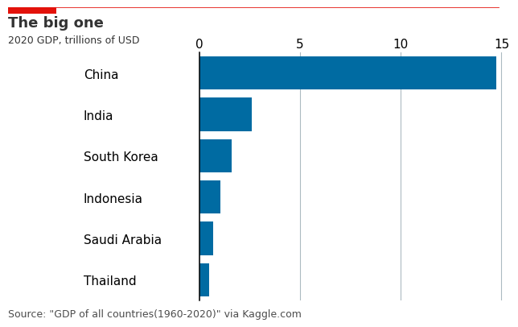

# PlotWisely

1. Know the audience
2. Choose appropriate display
3. Eliminate clutter
4. Focus subjectively
5. Good design traits, simple and consistency
6. Tell the story

--

Reference:
- Radovan Kavicky/2022-07-01 Making Economist Style Plots in Matplotlib
- Economist
- Storytelling with Data: A Data Visualization Guide for Business Professionals by Cole Nussbaumer Knaflic
- Matplotlib API Reference
